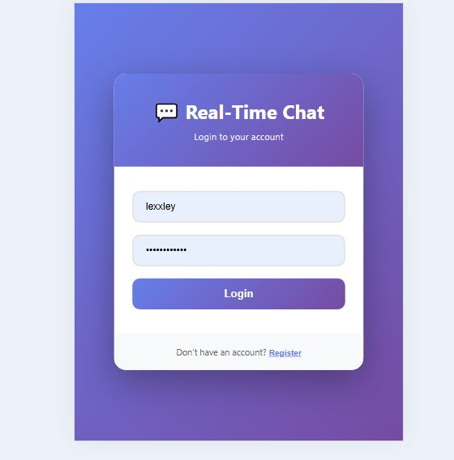
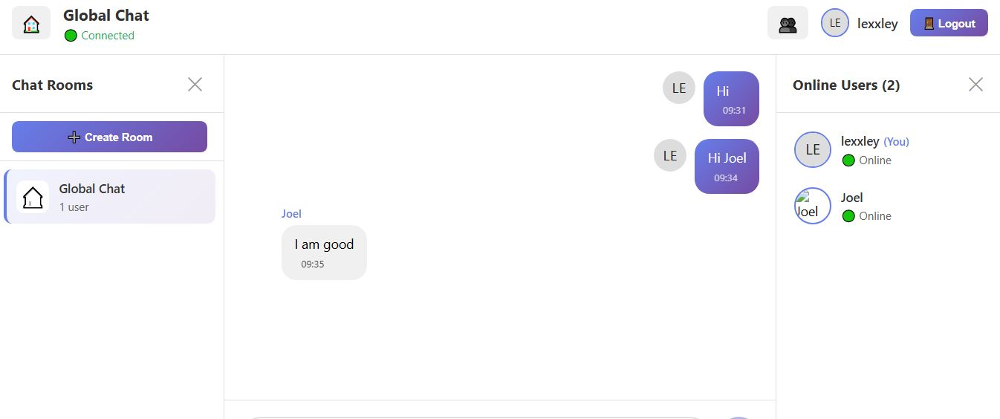

# 💬 Real-Time Chat Application

A feature-rich real-time chat application built with Socket.io, React, and Node.js. This application demonstrates bidirectional communication with features like live messaging, typing indicators, reactions, multiple rooms, and more.


## ✨ Features

### Core Features
- ✅ Real-time messaging with Socket.io
- ✅ User authentication (username-based)
- ✅ Global chat room
- ✅ Online/offline user status
- ✅ Message timestamps
- ✅ Typing indicators
- ✅ Connection status indicator

### Advanced Features
- ✅ Multiple chat rooms/channels
- ✅ Create custom rooms
- ✅ Message reactions (emojis)
- ✅ Real-time notifications
- ✅ Browser notifications
- ✅ Sound notifications
- ✅ Unread message counter
- ✅ User avatars
- ✅ Smooth animations
- ✅ Responsive design (mobile & desktop)
- ✅ Auto-reconnection on disconnect

## 🛠️ Tech Stack

### Backend
- Node.js
- Express.js
- Socket.io (v4.6.1)
- CORS
- dotenv

### Frontend
- React (v18.2.0)
- Socket.io Client (v4.6.1)
- Vite (Build tool)
- date-fns (Date formatting)
- CSS3 (Styling)

## 📁 Project Structure

```
real-time-chat/
├── client/                 # React frontend
│   ├── public/
│   ├── src/
│   │   ├── components/     # React components
│   │   │   ├── Header.jsx
│   │   │   ├── MessageList.jsx
│   │   │   ├── MessageInput.jsx
│   │   │   ├── UserList.jsx
│   │   │   ├── RoomList.jsx
│   │   │   └── TypingIndicator.jsx
│   │   ├── pages/          # Page components
│   │   │   ├── Login.jsx
│   │   │   └── Chat.jsx
│   │   ├── socket/         # Socket.io configuration
│   │   │   └── socket.js
│   │   ├── App.jsx
│   │   ├── main.jsx
│   │   └── index.css
│   ├── package.json
│   └── vite.config.js
│
├── server/                 # Node.js backend
│   ├── socket/             # Socket.io handlers
│   │   └── socketHandlers.js
│   ├── .env                # Environment variables
│   ├── server.js           # Main server file
│   └── package.json
│
└── README.md
```

## 🚀 Getting Started

### Prerequisites
- Node.js (v18 or higher)
- npm or yarn

### Installation

1. **Clone the repository**
   ```bash
   git clone <your-repo-url>
   cd real-time-communication-with-socket-io-Austinixe
   ```

2. **Install server dependencies**
   ```bash
   cd server
   npm install
   ```

3. **Install client dependencies**
   ```bash
   cd ../client
   npm install
   ```

4. **Configure environment variables**
   
   Create a `.env` file in the `server` directory:
   ```env
   PORT=5000
   JWT_SECRET=your_super_secret_jwt_key_change_this_in_production
   NODE_ENV=development
   CLIENT_URL=http://localhost:5173
   ```

5. **Start the development servers**

   In one terminal (server):
   ```bash
   cd server
   npm run dev
   ```

   In another terminal (client):
   ```bash
   cd client
   npm run dev
   ```

6. **Open your browser**
   
   Navigate to `http://localhost:5173`

## 📱 Usage

1. **Login**: Enter a username (minimum 3 characters)
2. **Send Messages**: Type in the message input and press Enter or click Send
3. **React to Messages**: Hover over any message and click an emoji
4. **Switch Rooms**: Click the 🏠 button to see available rooms
5. **View Online Users**: Click the 👥 button to see who's online
6. **Create Room**: Click "Create Room" in the rooms sidebar
7. **Logout**: Click the "Logout" button in the header

## 🎯 Key Features Explained

### Real-Time Communication
- Instant message delivery using Socket.io
- Automatic reconnection on network issues
- Efficient event-based communication

### Typing Indicators
- Shows when other users are typing
- Automatically hides after 2 seconds of inactivity

### Message Reactions
- Click on any message to add emoji reactions
- See how many users reacted with each emoji

### Notifications
- In-app notifications for new messages
- Browser notifications (with permission)
- Sound alerts for incoming messages
- Unread message counter in tab title

### Multiple Rooms
- Switch between different chat rooms
- Create custom rooms
- See user count in each room

## 🔧 Configuration

### Server Configuration
Edit `server/.env`:
- `PORT`: Server port (default: 5000)
- `CLIENT_URL`: Frontend URL for CORS
- `JWT_SECRET`: Secret key for authentication

### Client Configuration
Edit `client/src/socket/socket.js`:
- `SERVER_URL`: Backend server URL

## 📦 Build for Production

### Build the client
```bash
cd client
npm run build
```

### Build output
The build files will be in `client/dist/`

## 🚀 Deployment

### Deploy Server
Recommended platforms:
- [Render](https://render.com)
- [Railway](https://railway.app)
- [Heroku](https://heroku.com)

### Deploy Client
Recommended platforms:
- [Vercel](https://vercel.com)
- [Netlify](https://netlify.com)
- [GitHub Pages](https://pages.github.com)

### Environment Variables for Production
Make sure to set:
- `NODE_ENV=production`
- `CLIENT_URL=<your-frontend-url>`

## 🐛 Troubleshooting

### Connection Issues
- Ensure both server and client are running
- Check firewall settings
- Verify CORS configuration
- Check browser console for errors

### Messages Not Sending
- Check Socket.io connection status
- Verify server is running
- Check network tab in browser dev tools

## 🤝 Contributing

Contributions are welcome! Please feel free to submit a Pull Request.

## 📝 License

This project is licensed under the ISC License.

## 👨‍💻 Author

Augustine Omonkaro Salami
- GitHub: [@Austinixe](https://github.com/Austinixe)


## 🖼️ Screenshots

### 1. Homepage & Search
* **Purpose:** Verifies Pagination and Search/Filtering controls are functional.
* 

### 2. Post Detail & Authorization
* **Purpose:** Verifies that the Edit and Delete buttons are visible only to the authenticated author.
* 

## 🙏 Acknowledgments

- Socket.io documentation
- React documentation
- The open-source community

---

Made with ❤️ using React and Socket.io


# Real-Time Chat Application with Socket.io

This assignment focuses on building a real-time chat application using Socket.io, implementing bidirectional communication between clients and server.

## Assignment Overview

You will build a chat application with the following features:
1. Real-time messaging using Socket.io
2. User authentication and presence
3. Multiple chat rooms or private messaging
4. Real-time notifications
5. Advanced features like typing indicators and read receipts

## Project Structure

```
socketio-chat/
├── client/                 # React front-end
│   ├── public/             # Static files
│   ├── src/                # React source code
│   │   ├── components/     # UI components
│   │   ├── context/        # React context providers
│   │   ├── hooks/          # Custom React hooks
│   │   ├── pages/          # Page components
│   │   ├── socket/         # Socket.io client setup
│   │   └── App.jsx         # Main application component
│   └── package.json        # Client dependencies
├── server/                 # Node.js back-end
│   ├── config/             # Configuration files
│   ├── controllers/        # Socket event handlers
│   ├── models/             # Data models
│   ├── socket/             # Socket.io server setup
│   ├── utils/              # Utility functions
│   ├── server.js           # Main server file
│   └── package.json        # Server dependencies
└── README.md               # Project documentation
```

## Getting Started

1. Accept the GitHub Classroom assignment invitation
2. Clone your personal repository that was created by GitHub Classroom
3. Follow the setup instructions in the `Week5-Assignment.md` file
4. Complete the tasks outlined in the assignment

## Files Included

- `Week5-Assignment.md`: Detailed assignment instructions
- Starter code for both client and server:
  - Basic project structure
  - Socket.io configuration templates
  - Sample components for the chat interface

## Requirements

- Node.js (v18 or higher)
- npm or yarn
- Modern web browser
- Basic understanding of React and Express

## Submission

Your work will be automatically submitted when you push to your GitHub Classroom repository. Make sure to:

1. Complete both the client and server portions of the application
2. Implement the core chat functionality
3. Add at least 3 advanced features
4. Document your setup process and features in the README.md
5. Include screenshots or GIFs of your working application
6. Optional: Deploy your application and add the URLs to your README.md

## Resources

- [Socket.io Documentation](https://socket.io/docs/v4/)
- [React Documentation](https://react.dev/)
- [Express.js Documentation](https://expressjs.com/)
- [Building a Chat Application with Socket.io](https://socket.io/get-started/chat) 